## Table of Contents
<!-- to regenerate call "npm run readme:generate-toc" -->

<!-- toc -->

- [Call generatoror](#call-generatoror)
    + [Call generator with default options](#call-generator-with-default-options)
    + [Call generator with additional options](#call-generator-with-additional-options)
- [Class diagram](#class-diagram)
  * [Interface generation](#interface-generation)
  * [Class generation](#class-generation)
  * [Class association generation](#class-association-generation)
  * [Class generalization generation](#class-generalization-generation)
- [Component diagram](#component-diagram)
  * [Component generation](#component-generation)
  * [Components dependency generation](#components-dependency-generation)
- [Sequence diagram](#sequence-diagram)
  * [Sequence diagram generation](#sequence-diagram-generation)
  * [Sequence diagram loop generation](#sequence-diagram-loop-generation)
  * [Sequence diagram condition generation](#sequence-diagram-condition-generation)
- [User interface diagram](#user-interface-diagram)
  * [UI iteractions generation](#ui-iteractions-generation)
- [Generated project](#generated-project)
  * [File and directory structure](#file-and-directory-structure)
  * [Build-in commands](#build-in-commands)
  * [Start local web server](#start-local-web-server)
  * ["Design to API" mapping explanation](#design-to-api-mapping-explanation)
    + [Sequence diagram as REST API endpoint implementation](#sequence-diagram-as-rest-api-endpoint-implementation)
      - [Example](#example)
    + [Class diagram as REST API endpoint implementation](#class-diagram-as-rest-api-endpoint-implementation)
      - [Example](#example-1)
  * ["Design to App" mapping explanation](#design-to-app-mapping-explanation)
    + [Class diagram to CRUD UI](#class-diagram-to-crud-ui)
      - [Example](#example-2)
      - [Example](#example-3)
    + ["User interface" diagram supported controls](#user-interface-diagram-supported-controls)
    + ["User interface" diagram to UI](#user-interface-diagram-to-ui)
    + [Bind data to controls from business process models](#bind-data-to-controls-from-business-process-models)
      - [Example](#example-4)
    + [Bind data to controls from domain entities](#bind-data-to-controls-from-domain-entities)
    + [How to display references?](#how-to-display-references)

<!-- tocstop -->

## Call generatoror
#### Call generator with default options
```
yo xmi <file-path>
```

* "**file-path**" is the path to XMI file and is required option. An error will be thrown when file path not specified.

Next options will be applied by default:
* "**type**" (default is "monolith") - type of project hat will be generated
* "**destination**" (default is "dist") - path, relative to current dir, where project will be generated

#### Call generator with additional options
```
yo xmi <file-path> --destination=<destination> --type=<type>
```

where "type" can be next:

- **monolith** - default when not specified and generates project as monolith "node"-based application
- **microservices** - generates set of individual actors

## Class diagram
### Interface generation
**Important!!!** Interface properties are not reflected in object that it implement. Only methods.

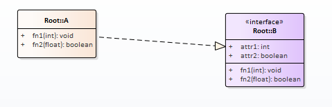

```typescript
// A
export class a extends aBase {
}

// A.generated
export abstract class aBase extends ComponentBase implements aContract {
    ...
    
    fn1(state: any): Promise < any > {
        ...
    }
    
    fn2(state: any): Promise < any > {
        ...
    }
}

// A.contract
export interface aContract {
    fn1(state: any): Promise < any > ;
    fn2(state: any): Promise < any > ;
}

// B.contract
/**
 * This file is auto-generated. Do not update it's content!
 */
export interface bContract {
    attr1: number;
    attr2: boolean;
    
    fn1(state: any): Promise < any > ;
    fn2(state: any): Promise < any > ;
}
```

### Class generation
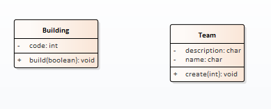

```typescript
// bulding
export class building extends buildingBase {
    //override base actions to implement own business behaviors
    build(state: any): Promise < any > {
        return super.build(state);
    }
}

// building.generated
export abstract class buildingBase extends ComponentBase implements buildingContract {
    code: number = 0;

    constructor() {
        super();
    }

    build(state: any): Promise < any > {
        ...
    }
}

// building.contract
export interface buildingContract {
    code: number;

    build(state: any): Promise < any > ;
}
```

### Class association generation
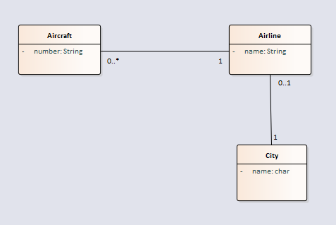

```typescript
// city
export abstract class cityBase extends ComponentBase implements cityContract {
    name: string = '';

    airlineRef: airlineContract | null = null;
    
    constructor() {
        super();
    }
}

// airline
export abstract class airlineBase extends ComponentBase implements airlineContract {
    name: string = '';

    aircraftRefList: aircraftContract[] = [];
    
    cityRef: cityContract | null = null;
    
    constructor() {
        super();
    }
}

// aircraft
export abstract class aircraftBase extends ComponentBase implements aircraftContract {
    number: string = '';

    airlineRef: airlineContract | null = null;
    
    constructor() {
        super();
    }
}
```

### Class generalization generation
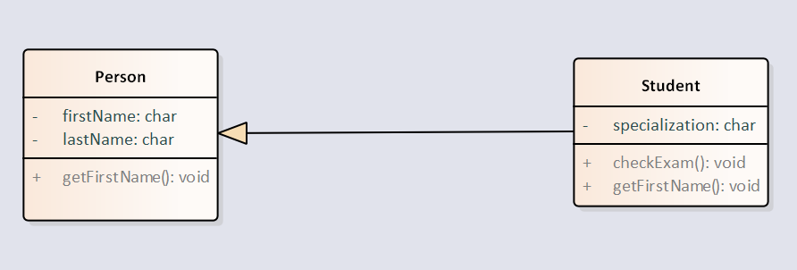

```typescript
// person
export abstract class personBase extends ComponentBase implements personContract {
    firstName: string = '';
    lastName: string = '';

    constructor() { super(); }

    getFirstName(state: any): Promise < any > {
        ...
    }
}

// student
export abstract class studentBase extends personBase implements studentContract {
    specialization: string = '';

    constructor() { super(); }

    checkExam(state: any): Promise < any > {
        ...
    }

    getFirstName(state: any): Promise < any > {
        ...
    }
}
```

## Component diagram
### Component generation
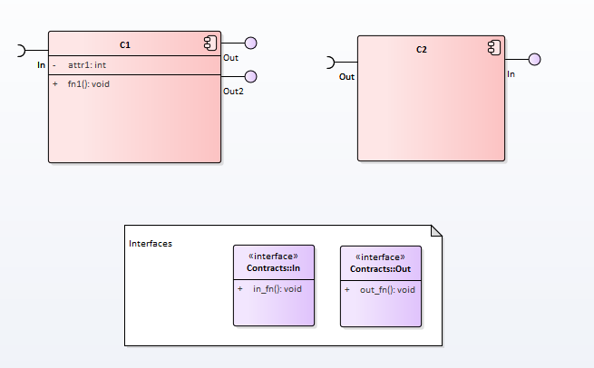

* input interfaces will be transformed into component constructor injected property
* output interfaces will be transformed into component public methods

```typescript
// C1
export class c1 extends c1Base {}

// C1.generated
export abstract class c1Base extends ComponentBase implements ... {
    // component own property
    attr1: number = 0;

    // constructor injected IN interface
    constructor(protected in: inContract) {
        super();
    }
    
    // component own method
    fn1(state: any): Promise < any > {
        ...
    }

    // output defined interface methods
    outFn(state: any): Promise < any > {
        ...
    }
}

// C2.generated
export abstract class c2Base extends ComponentBase implements c2Contract, inContract {
    constructor(protected out: outContract) {
        super();
    }

    inFn(state: any): Promise < any > {
        ...
    }
}

// In.interface
export interface inContract {
    inFn(state: any): Promise < any > ;
}

// Out.interface
export interface outContract {
    outFn(state: any): Promise < any > ;
}
```

### Components dependency generation
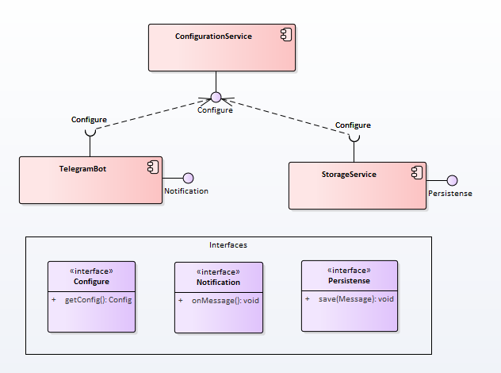

* `TelegramBot` and `StorageService` components depends on `ConfidurationService` component
* Dependent component is injected through component constructor
* Exposed interfaces are represented as component public methods 

ConfigurationService.generated
```typescript
// ConfigurationService.generated
export abstract class configurationServiceBase extends ComponentBase implements ... {
    constructor() { super(); }

    getConfig(state: any): Promise < any > { ... }
}

// StorageService.generated
export abstract class storageServiceBase extends ComponentBase implements ... {
    constructor(protected configure: configureContract) {
        super();
    }

    save(state: any): Promise < any > {
        ...
    }
}

// TelegramBot.generated
export abstract class telegramBotBase extends ComponentBase implements ... {
    constructor(protected configure: configureContract) {
        super();
    }

    onMessage(state: any): Promise < any > {
        ...
    }
}

// Configure.interface
export interface configureContract {
    getConfig(state: any): Promise < any > ;
}

// Persistense.interface
export interface persistenseContract {
    save(state: any): Promise < any > ;
}

// Notification.interface
export interface notificationContract {
    onMessage(state: any): Promise < any > ;
}
```

## Sequence diagram
### Sequence diagram generation
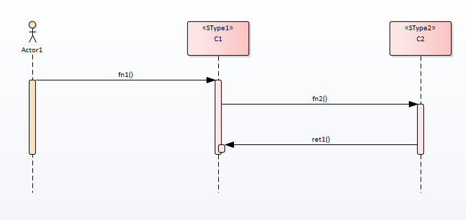

* `inputState` is an process initial data
* All actors injected into process through constructor injection
* Actions considered as async operations and returned `Promise`

```typescript
export class eaCollaboration1 {
    constructor(
        // Actor1
        private cmpactor1: actor1Contract,

        // C1
        private cmpc1: c1Contract,

        // C2
        private cmpc2: c2Contract) {}

    /**
    /* Execute process
    */
    run(inputState: any) {
        let flowAsync = Promise.resolve(inputState);

        // Configure state storage
        flowAsync = flowAsync.then((state: any) => {
            return storage.init( /* options ... */ );
        });

        // actor1 call c1
        flowAsync = flowAsync.then((state: any) => {
            return this.cmpc1.fn1(state);
        });

        // c1 call c2
        flowAsync = flowAsync.then((state: any) => {
            return this.cmpc2.fn2(state);
        });

        // c2 call c1
        flowAsync = flowAsync.then((state: any) => {
            return this.cmpc1.ret1(state);
        });

        return flowAsync.catch(x => console.log(chalk.red('ERROR: '), x));
    }
}
```

### Sequence diagram loop generation
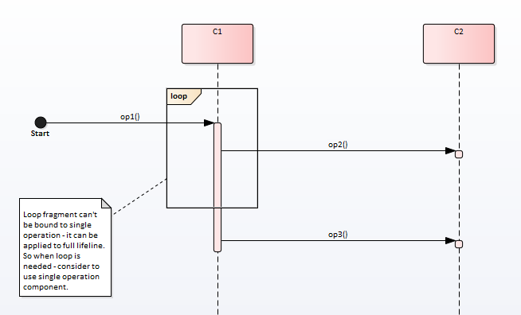

Loop condition is used to repeat certain sub-flow number of times based on loop condition check result.

When generated - component declaration is extended with additional properties:
* `loopCondition` - returns condition value to determine should be loop repeated or halted.
* `loopDelay` - timeout between loop executions.

```typescript
export abstract class c1Base extends ComponentBase implements c1Contract {
    constructor() { super(); }

    /**
     * Loop condition.
     * Check condition value to determine should be loop repeated or halted.
     * When function returns TRUE - loop is going to be repeated.
     */
    get loopCondition(): boolean {
        return true;
    }

    /**
     * Get loop delay in ms.
     * This parameter is used to sleep between loop executions.
     */
    get loopDelay(): number {
        return 30 * 1000; //30 sec
    }

    /**
     * op1 description.
     */
    op1(state: any): Promise < any > {
        ...
    }
}
```

### Sequence diagram condition generation
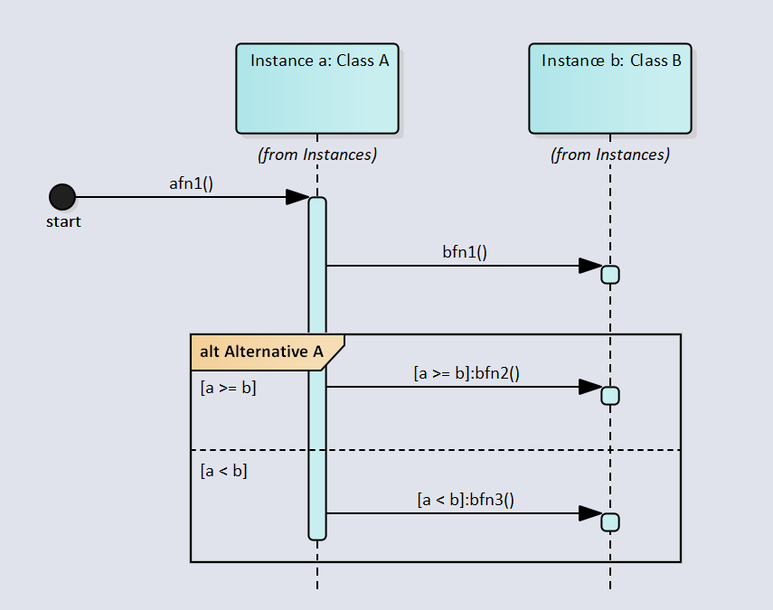

"Alt condition" is used to choose execution flow based on specific condition(s). 
Many conditions can be applied to single "alt block", so on solution level condition block
can be represented using "switch" pattern. 

When generated - component declaration is extended with additional functions to check condition status
```typescript
export abstract class classABase extends ComponentBase implements classAContract {
    constructor() { super(); }
    
    //# region Message conditions
    'a >= b'(state: any) {
        return true;
    }
    
    'a < b'(state: any) {
        return true;
    }
    //# endregion
    
    ...
}
```

Sequence flow with check condition state to choose right flow
```typescript
export class eaCollaboration1 {
    constructor() { ... }
    
    /**
    /* Execute process
    */
    run(inputState: any) {
        let flowAsync = Promise.resolve(inputState);

        // define flow
        // Start call classA
        flowAsync = flowAsync.then((state: any) => {
            state.start = new Date();
            return this.cmpclassA.afn1(state);
        });
        
        // classA call classB
        flowAsync = flowAsync.then((state: any) => {
            state.start = new Date();
            return this.cmpclassB.bfn1(state);
        });
        
        // classA call classB
        flowAsync = flowAsync.then((state: any) => {
            state.start = new Date();
            if (this.cmpclassA['a >= b'](state)) {
                return this.cmpclassB.bfn2(state);
            } else {
                return state;
            }
        });
        
        // classA call classB
        flowAsync = flowAsync.then((state: any) => {
            state.start = new Date();
            if (this.cmpclassA['a < b'](state)) {
                return this.cmpclassB.bfn3(state);
            } else {
                return state;
            }
        });
        
        return flowAsync.catch(x => console.log(chalk.red('ERROR: '), x));
    }
}
```
**!!! Important**
"Alt condition" should be duplicated in message properties
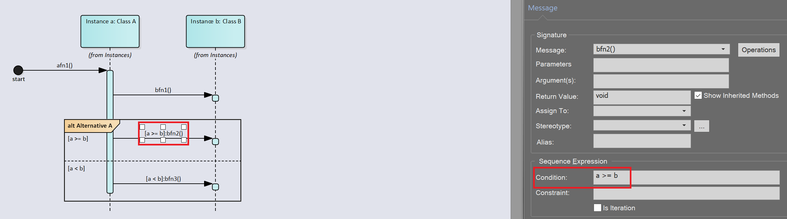

## User interface diagram
### UI iteractions generation
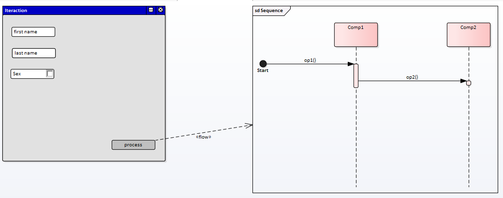

* Screen can be configured to execute instructions (designed as sequence diagram) when applied to action control (button)
* By default user input to start process can be obtained though CMD terminal

```typescript
//process.generated
export class iteraction {
    run() {
        const answers = inquirer.prompt([{
            type: 'checkbox',
            name: 'sex',
            message: 'Enter Sex',
            choices: ['male', 'female']
        }, {
            type: 'textbox',
            name: 'firstName',
            message: 'Enter first name'
        }, {
            type: '',
            name: 'lastName',
            message: 'Enter last name'
        }, ]);

        const collaboration0 = new eaCollaboration1(new comp1(), new comp2());
        collaboration0.run(answers);
    }
}

//sequence.generated
export class eaCollaboration1 {
    constructor(
        // Comp1
        private cmpcomp1: comp1Contract,

        // Comp2
        private cmpcomp2: comp2Contract) {}

    run(inputState: any) {
        let flowAsync = Promise.resolve(inputState);

        // Configure state storage
        flowAsync = flowAsync.then((state: any) => {
            return storage.init( /* options ... */ );
        });

        // Start call comp1
        flowAsync = flowAsync.then((state: any) => {
            return this.cmpcomp1.op1(state);
        });

        // comp1 call comp2
        flowAsync = flowAsync.then((state: any) => {
            return this.cmpcomp2.op2(state);
        });

        return flowAsync.catch(x => console.log(chalk.red('ERROR: '), x));
    }
}
```

`ts-node design\userInterfaceModel\test\screen_iteraction.ts`
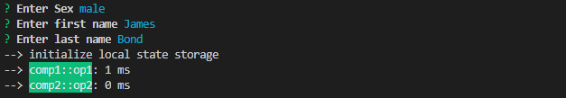

## Generated project
### File and directory structure
* "**api**" - contains all necessary files to start project as local web service
* "**cmd**" - contains set of executable commands to execute repetative actions
* "**design**" - contains all EA-related generated files and artifacts: classes, components, diagrams implementation, etc
* "**utils**" - project specific utilities

### Build-in commands
Each generated sequence diagrams can be represented as individual API endpoint so can be triggered by any REST client or from bound Swagger client. Swagger is also added as part of generated project.

Next command will be available after project generation:
* "**api:compile**" - compile application
* "**api:start**" - start local web server
* "**api:dev**" - start local web server in debug mode (with ability to debug)
* "**api:test**" - test generated project

### Start local web server
Navigate to "[http://localhost:3000/api-explorer](http://localhost:3000/api-explorer)" to run local Swagger.

### "Design to API" mapping explanation
#### Sequence diagram as REST API endpoint implementation
Each sequence diagram presented in model will be translated into individual REST API endpoint that can interact with system through POST method.

##### Example
Diagram


REST API contract

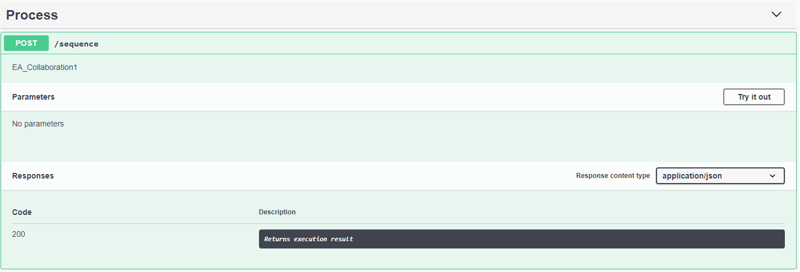

REST API call
```CMD
curl -X POST "http://localhost:3000/api/v1/sequence" -H "accept: application/json"

--> initialize local state storage
--> c1::fn1: 1 ms
--> c2::fn2: 0 ms
--> c1::ret1: 0 ms
```

#### Class diagram as REST API endpoint implementation
Each class in model will be covered with set of API to implement full CRUD support.

##### Example
Diagram


Generated REST API

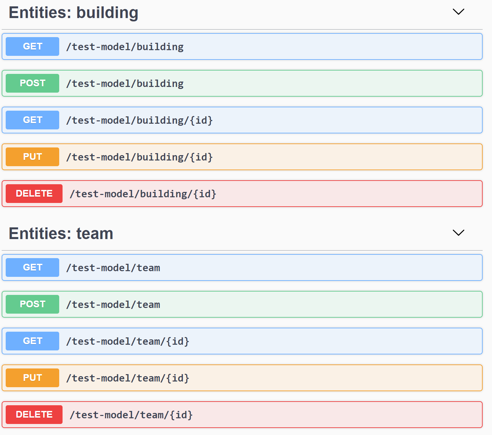

### "Design to App" mapping explanation
#### Class diagram to CRUD UI
Each class in class diagram is represented as set of user forms to perform all set of CRUD operations.

##### Example
Class in class diagram

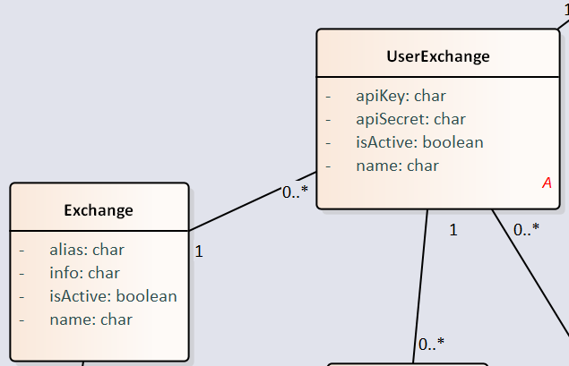

Generated forms:
1) List all entities with support to add new
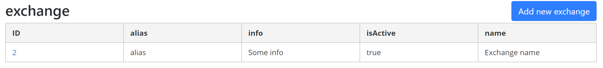
When list is populated - first row represents link to navigate to edit form.

2) Create/Edit entity
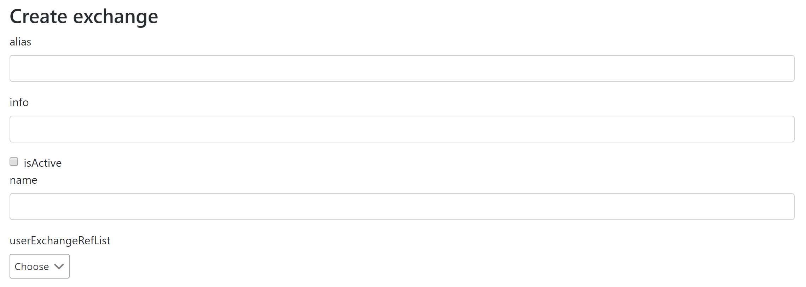
sented as separated screen in application.

##### Example
User interface diagram 
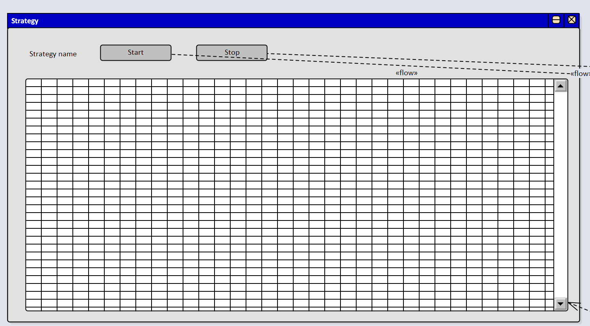

Generated screen
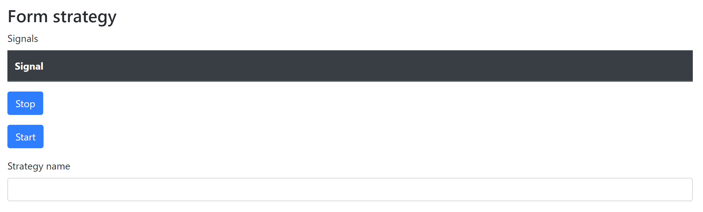

#### "User interface" diagram supported controls
#### "User interface" diagram to UI
Each "User Interface" diagram is repre
| Conrol | Description |  Example |
|----------|-------------|------|
| Text | Represents simple editbox | 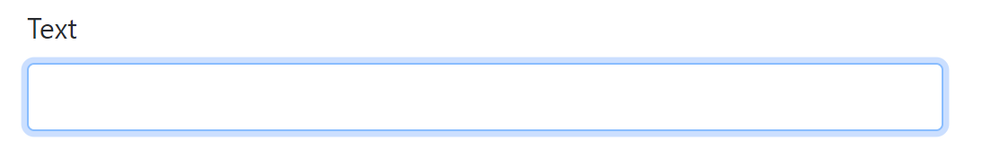 |
| Button | Action control represented as clickable button |  |
| Checkbox | Allows to confirm user intention | 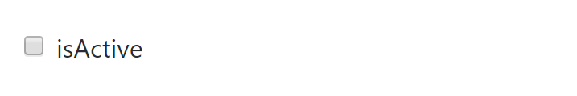 |
| Combobox | Allows to select single value from list of proposals | 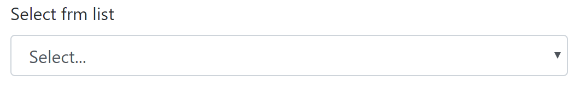 |
| Panel | Allows to group controls into single container |  |
| Table | Allows to represent list data | 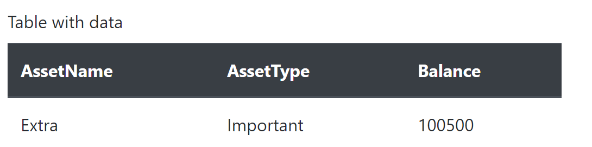 |

#### Bind data to controls from business process models
To be able to populate data into specific controls - this controls need to be linked with diagrams that defines business process to collect data.
This linkage can be implemented with using "Information flow" link connector.

As data comes from business process to controls - flow should be properly directed: from process to control.

##### Example
In this example grid control is linked with diagram, defined some business process. Diagram can be dragged to UI form.
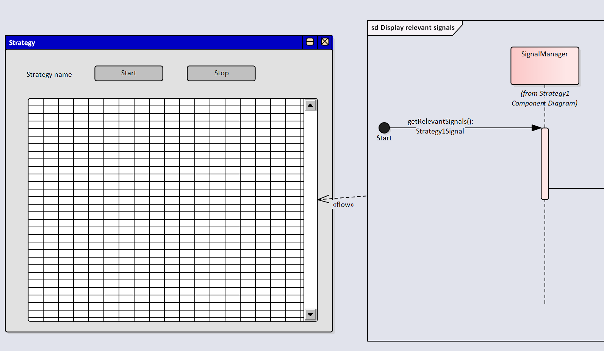

After generation - grid will trigger process execution to bind data. As process is represented with separate API endpoint - 
result of API call will be used as grid data.

Similar implementation with binding combo list
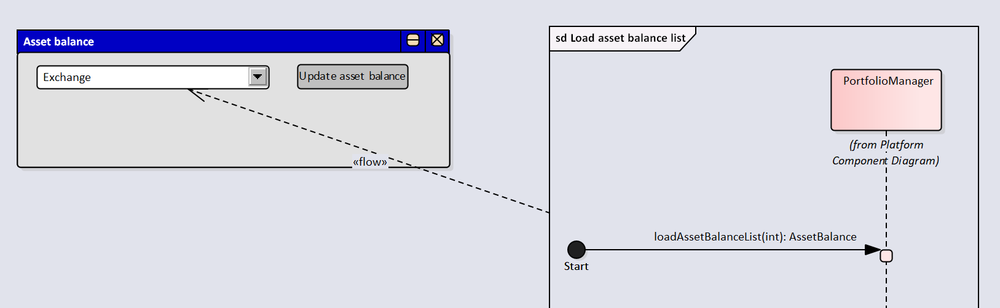

#### Bind data to controls from domain entities
As each class in class diagrams will be represented with own form to manage data - it's expected that user custom forms also need access to this data.
The most common example - allow to select single item from all available items for particular domain entity type.

To add this sort of component into user interface form to get automatic data linkage to domain entity values - class element need to be added to user interface form.
How to do:
1) Drop any class into user interface model and specify "drop as" parameter to "instance"
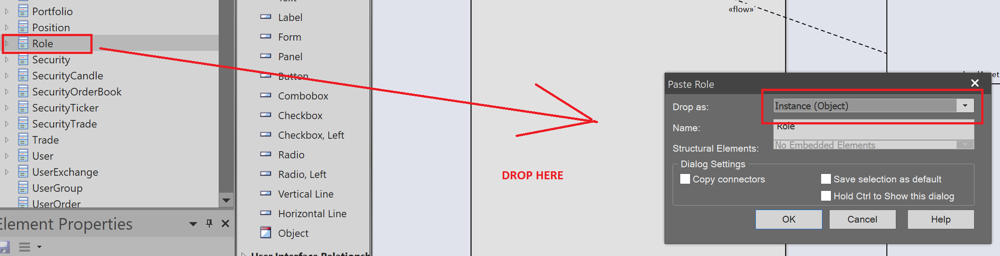
2) In property window change type of this control to "GUIElement"
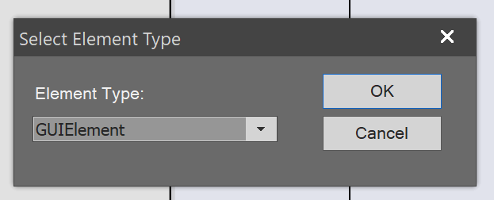
3) Specify all required attributes (name and alias) and set stereotype to "combobox"
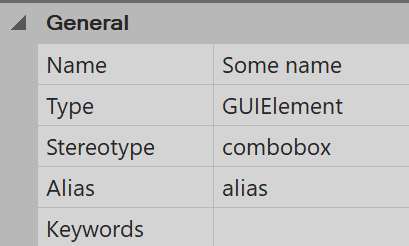

After this actions class element will be represented as native "combobox" and will be linked to defined class entity.
After form generation - control will be bound to data for this class entity.
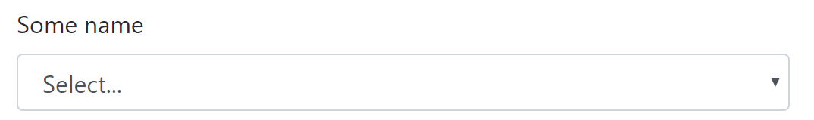

#### How to display references?
Referenced entities are displayed in dropdowns to simplify linking. 
Example: `UserExchange` entity has reference to `Exchange` entity, so while creating new `UserExchange`
entity user will be able to select linked `Exchange` from dropdown on edit form.
 
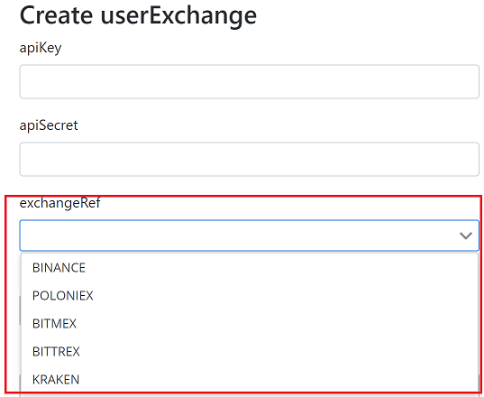

Reference control (`ExchangeRef`) by default uses "`name`" property to display in popup window. If "`name`"
property not exists in entity - uses `displayName` tag to properly map to property that need to be shown in popup.

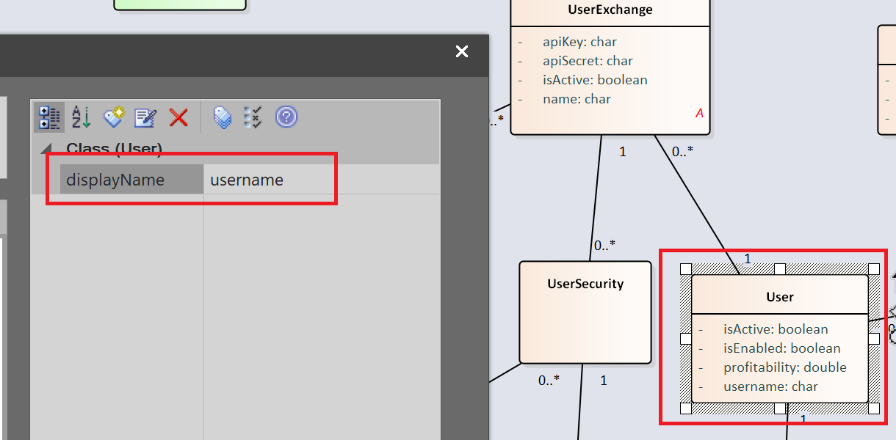

In this example `User` entity don't have "`name`" field, so "`username`" field will be displayed when
will be mapped to user controls.
